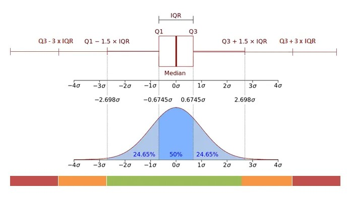

*Desenvolvido em R versão 4.3.2 (2023-10-31 ucrt)*

```{r setup, include=FALSE}
knitr::opts_chunk$set( echo=TRUE, message=FALSE, warning=FALSE )
options(scipen=999) # "Desliga" notação científica. 

# PACOTES 
library(tidyverse)

# PRETTY DOC
library(gt)
library(patchwork)

theme_set(theme_light())
theme_update(
  panel.grid.minor = element_blank(),
  plot.title = element_text(size = 12, colour = "gray30", face = "bold"),
  plot.subtitle = element_text(face = 'italic', colour = "gray50", size = 10),
  plot.caption = element_text(colour = "gray50", hjust=0, size = 8),
  legend.title = element_blank(),
)
```

\

# Introdução

Nessa disciplina, aprofundamos nossos conhecimentos na linguagem R e de estatística, para realizar análises descritivas de bases de dados, tarefa que é extremamente importante para o dia-a-dia de um cientista de dados. Agora iremos validar nosso conhecimento.

```{r pacotes}
# PACOTES 
library(tidyverse)

# PRETTY DOC
library(gt)
library(patchwork)
```

\

# P01

**O relatório final deve ser apresentado utilizando RMarkdown. Nesse relatório devem haver:**

-   imagens estáticas ("prints" de tela, imagens da internet - com a devida fonte mencionada - ou figuras criadas pelo aluno fora do ambiente do R);\
-   imagens geradas através do ambiente R, particularmente com a biblioteca ggplot;\
-   links clicáveis (como fontes e referências).\

\

# P02 Base de dados

**Escolha uma base de dados para realizar esse projeto. Essa base de dados será utilizada durante toda sua análise. Essa base necessita ter 4 (ou mais) variáveis de interesse, onde todas são numéricas (confira com o professor a possibilidade de utilização de dados categóricos). Observe que é importante que haja dados faltantes em pelo menos uma variável para executar esse projeto. Caso você tenha dificuldade para escolher uma base, o professor da disciplina irá designar para você. Explique qual o motivo para a escolha dessa base e aponte os resultados esperados através da análise.**

A base de dados utilizada reune os componentes do Índice de Desenvolvimento Humano - IDH (UNDP 2024) comparando os resultados de 195 países.

O IDH surge no Programa das Nações Unidas para o Desenvolvimento (PNUD) e no Relatório de Desenvolvimento Humano (RDH). Estes foram criados e lançados por uma equipe de economistas liderada pelo economista paquistanês Mahbub ul Haq em 1990 diante das limitações dos indicadores puramente focados na riqueza produzida por um país para refletir o bem estar geral de uma sociedade e seu nível de desenvolvimento. Dessa forma, além do crescimento econômico, o IDH adiciona saúde e educação (capacitação das pessoas) como critérios complementares para avaliar o bem estar de um país e seu desenvolvimento.

O IDH pode ser utilizado para questionar as escolhas de políticas e alocação de recursos de um país, perguntando como é que dois países com o mesmo nível de GNI (Gross National Income) per capita podem ter níveis de desenvolvimento humano diferentes. Estes contrastes podem estimular o debate sobre as prioridades políticas dos governos.

O IDH resume o desempenho de um país em três dimensões-chave do desenvolvimento humano:

1)  Uma vida longa e saudável, medida pela [Expectativa de vida ao nascer em anos]{.underline};\

2)  Conhecimento e oportunidade de desenvolvimento individual, medidos pela [Média de anos completados de escolaridade]{.underline} para adultos com 25 anos ou mais e [anos de escolaridade esperados]{.underline} ao entrar no sistema educacional; e\

3)  Um padrão de vida digno, medido pela [Renda Nacional Bruta per capita]{.underline} (Gross National Income) em dólares de 2017 com paridade de poder de compra (PPP).

\

{width="600"}

\

Tecnicamente o IDH é a média geométrica dos índices normalizados para cada uma das três dimensões.

O IDH é um indicador resumido e capta apenas parte dos fatores que traduzem o bem-estar de um país. Ele não reflete as desigualdades no acesso à saúde, educação ou na distribuição de renda de um país. O Relatório de Desenvolvimento Humano de 2010 introduziu o Índice de Desenvolvimento Humano Ajustado à Desigualdade -- IDHI.

O IDHI é o nível real de desenvolvimento humano considerando a desigualdade, enquanto o IDH pode ser visto como um índice de desenvolvimento humano 'potencial', ou o nível máximo de IDH que poderia ser alcançado se não houvesse desigualdade.

O IDHI considera as desigualdades nas três dimensões do IDH “descontando” o valor médio de cada dimensão de acordo com o seu nível de desigualdade. O valor do IDHI é igual ao valor do IDH quando não há desigualdade entre as pessoas, mas cai abaixo do valor do IDH à medida que a desigualdade aumenta.

**O objetivo deste projeto é analisar a evolução do IDHI entre 2012 e 2022, investigar a contribuição dos componentes do IDH e comparar os resultados do IDHI com o IDH simples. Complementaos essa análise exploratória adicionando dados de população para incluir uma dimensão do porte relativo de cada país.**


\

O código a seguir usa o pacote `wbstats` para baixar tabela auxiliar de países e regiões compilada pelo Banco Mundial:

```{r}
# Tabela auxiliar de códigos e classificações de países
ta.countries <- wbstats::wb_countries() |> 
  select(iso3c, country, region, rendapc_cat = income_level) |> 
  mutate(
    country = case_match(country,
                         "Korea, Dem. People's Rep." ~ "North Korea",
                         "Korea, Rep." ~ "South Korea",
                         "Egypt, Arab Rep." ~ "Egypt",
                         "Iran, Islamic Rep." ~ "Iran",
                         "West Bank and Gaza" ~ "Palestine",
                         "Syrian Arab Republic" ~ "Syria",
                         "Hong Kong SAR, China" ~ "Hong Kong",
                         "Macao SAR, China" ~ "Macao",
                         "Russian Federation" ~ "Russia",
                         "Micronesia, Fed. Sts." ~ "Micronesia",
                         "United Kingdom" ~ "UK",
                         "United States" ~ "USA",
                         "United Arab Emirates" ~ "UAE",
                         "Venezuela, RB" ~ "Venezuela",
                         "Yemen, Rep." ~ "Yemen",
                         .default=country),
    country = str_remove(country, ", The")
  )
```

\

O código a seguir lê dados do IDH.

```{r}
df.onu <- read.csv("_datasets/HDR23-24_Composite_indices_complete_time_series.csv",) |> 
  select(-region, -country) |> select(-hdi_rank_2022) |> 
  # coloca a tabela "em pé" no estilo tidy
  pivot_longer(3:1073) |> 
  # Remove obs que têm dados faltantes em TODAS as variáveis numéricas
  filter(!is.na(value)) |> 
  # separa a coluna name em duas colunas: o nome do indicador e o ano
  separate(name, into=c("indicador","ano"), sep=-4, remove=T) |> 
  mutate(ano = as.integer(ano),
         indicador = str_sub(indicador, 1, -2),
         hdicode = if_else(is.na(hdicode), "Not classified", hdicode)) |> 
  # Seleciona as variáveis de interesse:
  filter(indicador %in% c(
    "hdi",       # Human Development Index
    "le",        # Life Expectancy at Birth (years)
    "eys",       # Expected Years of Schooling (years)
    "mys",       # Mean Years of Schooling (years)
    "gnipc",     # Gross National Income Per Capita (2017 PPP$)
    'ineq_le',   # Inequality in life expectancy,
    'ineq_edu',  # Inequality in education,
    'ineq_inc',  # Inequality in income,
    'ihdi'       # Inequality-adjusted Human Development Index
  )) |> 
  # Coloca a tabela "deitada" de forma que cada indicador fique em uma coluna
  pivot_wider(names_from=indicador, values_from=value) |> 
  mutate(across(where(is.character), ~if_else(.x=="",NA,.x))) |> 
  # Customiza os nomes das variáveis (GLOSSÁRIO)
  rename(
    iso3c       = iso3,     # Código identificador inequívoco do país
    idh_cat     = hdicode,  # Categorias do IDH (Low, Medium, High, Very High)
    idh         = hdi,      # Indice de Desenvolvimento Humano
    rendapc     = gnipc,    # Renda nacional bruta per capita em US$ PPP constante de 2017
    exp.vida    = le,       # Expectativa de vida ao nascer em anos
    escol.esp   = eys,      # Anos de escolaridade esperada ao entrar no sistema educacional
    escol.media = mys,      # Média de anos completados de escolaridade (adultos de 25 anos ou mais)
    exp.vidai   = ineq_le,  # Desigualdade na expectativa de vida
    escoli      = ineq_edu, # Desigualdade na escolaridade
    rendai      = ineq_inc, # Desigualdade na renda per capita
    idhi        = ihdi,     # Índice de desenvolvimento humano ajustado para desigualdade
  ) |> 
  relocate(idhi, .after=everything())

fonte.un <- "Programa das Nações Unidas para o Desenvolvimento (PNUD), Human Development Report 2023/2024"
```

\

O código a seguir usa o pacote `wbstats` para baixar os dados de população por país compilados pelo Banco Mundial.

```{r}
df.wb0 <- wbstats::wb_data(c("pop" = "SP.POP.TOTL"), start_date=2010, end_date=2022) |> 
  select(iso3c, ano=date, pop) |> 
  mutate(ano=as.integer(ano), pop_milhoes = pop/1e+6) |> 
  filter(!is.na(pop_milhoes)) |> 
  select(-pop)

# Cria categoria de tamanho da população do país 
df.wb <- df.wb0 |> 
  slice_max(ano, n=1) |> 
  mutate(pop_cat = cut(pop_milhoes, breaks=c(0,1,10,50,200,Inf), ordered_result=T)) |> 
  select(iso3c, pop_cat) |> 
  left_join(df.wb0, join_by(iso3c))

attr(df.wb$pop_milhoes, "label") <- NULL # remove o atributo "label" da df
fonte.wb <- "Banco Mundial, World Development Indicators."
```


\

O código a seguir reúne os datasets em uma base única.

```{r}
df0 <- inner_join(ta.countries, df.onu, join_by(iso3c)) |> 
  left_join( df.wb, join_by(iso3c, ano) ) |> 
  mutate(
    rendapc_cat = factor(rendapc_cat, levels=c("Low income", 
                                               "Lower middle income", 
                                               "Upper middle income", 
                                               "High income"),
                         ordered=T),
    idh_cat = factor(idh_cat, levels=c("Low", "Medium", "High", "Very High"),
                     ordered=T)
  ) |> 
  mutate(rendapc = rendapc/1000) |> rename(rendapc_mil = rendapc) |> 
  relocate(pop_cat, .after=rendapc_cat) |> 
  relocate(pop_milhoes, .after=idh) |> 
  # Remove obs que têm dados faltantes em TODAS as variáveis numéricas
  pivot_longer(idh:idhi, values_drop_na=T) |> pivot_wider() |> 
  filter(ano >= 2010) |> # o IDHI passou a ser medido a partir de 2010
  arrange(ano, iso3c)

df1 <- df0 |> filter(ano %in% c(2012, 2022))
```


\

```{r fig.width=5, fig.asp=.5}
df0 |> summarise(n.paises = n_distinct(iso3c), .by=ano) |> arrange(ano) |> 
  mutate(ano = as.factor(ano)) |> 
  ggplot(aes(x=ano, y=n.paises)) +
  geom_col(fill="slategray") +
  geom_text(aes(label=scales::number(n.paises)), vjust = -0.5, size = 3) +
  scale_y_continuous(expand=expansion(mult=c(0,.1)), breaks=NULL) +
  scale_x_discrete() +
  theme(panel.grid.major=element_blank(),
        axis.title=element_blank(),
        axis.text=element_text(size=8)) +
  labs(title = "Quantidade de países no dataset por ano")
```


```{r include=FALSE}
rm(df.onu, df.wb, df.wb0, ta.countries); gc()
```

\

# P03 Estatísticas descritivas X

**Utilizando o pacote `summarytools` (função `descr`), descreva estatisticamente a sua base de dados.**

```{r}
res.DescrStat <- data.frame()
for (v_ano in unique(df1$ano)) {
  res.DescrStat <- rbind(
    res.DescrStat,
    summarytools::descr(df1 |> filter(ano==v_ano) |> select(-ano), na.rm=T, transpose=T) |> 
      as.data.frame() |> rownames_to_column("variavel") |> 
      mutate(ano = v_ano, .after=variavel)
  )
}; rm(v_ano)


res.DescrStat |> mutate(Pct.Valid = Pct.Valid/100) |> 
  group_by(variavel) |> 
  gt(rowname_col="stub", locale="pt") |> sub_missing() |>
  fmt_number(c(Mean:IQR, Skewness), decimals=1) |> 
  fmt_number(c(SE.Skewness), decimals=2) |> 
  fmt_integer(Kurtosis) |> 
  fmt_percent(c(CV, Pct.Valid), decimals=0) |> 
  tab_options(
    heading.align="left", heading.title.font.size=pct(110), heading.subtitle.font.size=pct(90),
    column_labels.font.weight="bold", column_labels.font.size=pct(80),
    column_labels.text_transform="uppercase", column_labels.background.color="gray95",
    data_row.padding=px(2), row_group.padding=px(2), row_group.font.weight="bold",
    table.font.size=pct(90), source_notes.font.size = pct(70),
  ) |> 
  tab_header(title = md("**Estatísticas descritivas da base de dados do IDHI, 2012/2022**"))
```

\

::: {.alert .alert-block .alert-info}
**Análise:**

As distribuições das variáveis de escolaridade parecem apontar leve melhoria (aumentaram os anos de escolaridade média e de escolaridade esperada dos países) entre 2011 e 2021 porque tanto as médias quanto as medianas aumentaram nesses dois indicadores.\


A variabilidade (Desvio padrão e CV) ficaram praticamente estáveis no indicador de escolaridade esperada, porém o IQR aumentou em amplitude (os países que compõem 50% da amostra estão mais "espalhados"), mas tanto o Q1 quanto o Q3 apresentam valores mais altos em 2021 que em 2011, o que pode apontar uma melhoria. O mínimo aumentou pouco mais de meio ano - ou seja, houve melhora do pior resultado na comparação entre 2011 e 2021 - porém houve queda de 1,4 anos na máxima escolaridade esperada atingida.\


No indicador de anos de escolaridade média, a variabilidade indicada pelo desvio padrão e pelo CV diminuíram. O resultado dos países que compõem 50% da amostra ficou levemente mais concentrado (IQR menor) e tanto o Q1 quanto o Q3 aumentaram. O mínimo teve um aumento expressivo, de 0,97 anos para 2,11 anos e o máximo também apresentou aumento, ainda que diminuto.\


Minha leitura dos resultados do eixo de escolaridade do IDH é de que houve certo avanço, a maioria dos países aparenta ter melhorado - ainda que o desenvolvimento observado seja relativamente pequeno para o que se poderia almejar em um período de 10 anos e os mínimos e o Q1 dos dois indicadores sejam assustadoramente baixos.\


O indicador de expectativa de vida em anos parece apontar tendência oposta à das variáveis de escolaridade. A queda na mediana entre 2011 e 2021 foi de meio ano, porém houve aumento de magnitude semelhante na média. O IQR, CV e Desvio Padrão de 2021 ficaram levemente menores, indicando certa tendência de concentração dos resultados dos países, o que pode ser visto como positivo. O mínimo da expectativa de vida aumentou 5,8 anos, assim como o Q1 (+1,7) - avanços significativos, especialmente considerando ser essa uma variável demográfica que leva em conta a totalidade da população de cada país e que essa década inclui o impacto mais agudo da pandemia de COVID-19.\


Renda e população são significativamente diferentes das outras distribuições, não apenas em escala, mas também em assimetria (skewness), com uma cauda longa à direita da distribuição (concentração de países com menos renda per capita e menor população).\


No caso da população, é possível que dois países que são outliers extremos (China e Índia têm população \~4x maior que os Estados Unidos, que é o terceiro maior país) estejam nos impedindo de enxergar a distribuição da grande maioria dos países.\


Como o IDH / IDHI são índices calculados a partir das outras variáveis exceto população, vamos fazer sua análise na conclusão do projeto.
:::


\

A normalização da base facilita a comparação visual da concentração dos dados dos países por ano:
FAZER NORMALIZAÇÃO POR MIN/MAX DE TODOS OS ANOS

```{r fig.width=8, fig.asp=.8}
# Função para normalizar um vetor para escala mínimo-máximo (0-1)
MinMaxNorm <- function(x, ...) {
  return( (x - min(x, ...)) / (max(x, ...) - min(x, ...)) )
}

# Normaliza a base
df1.norm <- df1  |> mutate(across(idh:idhi, ~MinMaxNorm(.x, na.rm=T)), .by=ano)
df1.padr <- df1  |> mutate(across(idh:idhi, scale), .by=ano)


theme_update(legend.position="bottom")
p1 <- df1  |> 
  pivot_longer(idh:idhi, names_to="indicador") |> 
  mutate(ano=as.factor(ano), indicador=fct_rev(indicador)) |> 
  ggplot(aes(y=indicador, x=value, fill=ano)) +
  geom_boxplot(outlier.colour="red", staplewidth=.5) + 
  scale_x_continuous(labels=scales::label_number(scale=1)) +
  scale_fill_brewer(palette = "Set2") +
  labs(subtitle = "Dados originais", x=NULL, y=NULL)

p2 <- df1.norm  |> 
  pivot_longer(idh:idhi, names_to="indicador") |> 
  mutate(ano=as.factor(ano), indicador=fct_rev(indicador)) |> 
  ggplot(aes(y=indicador, x=value, fill=ano)) +
  geom_boxplot(outlier.color="red", staplewidth=.5) +
  scale_fill_brewer(palette = "Set2") +
  labs(subtitle = "Dados normalizados (min-max)", x=NULL, y=NULL)

p3 <- df1.padr  |> 
  pivot_longer(idh:idhi, names_to="indicador") |> 
  mutate(ano=as.factor(ano), indicador=fct_rev(indicador)) |> 
  ggplot(aes(y=indicador, x=value, fill=ano)) +
  geom_boxplot(outlier.color="red", staplewidth=.5) +
  scale_fill_brewer(palette = "Set2") +
  labs(subtitle = "Dados padronizados (z-score)", x=NULL, y=NULL)

p1 + p2 + p3 + plot_annotation(
  title = "Boxplot dos Indicadores dos Países",
  caption= paste0("Fonte:\n", fonte.un, "\n", fonte.wb)
) + plot_layout(guides="collect", axes="collect")
```

```{r include=FALSE}
rm(p1,p2,p3); gc()
```

\

# P04 Correlação

**Crie um gráfico com a matriz de espalhamento (scatter matrix plot) para sua base de dados. Através de investigação visual, quais são as variáveis mais correlacionadas. Apresente o gráfico e justifique.**


::: {.alert .alert-block .alert-info}
**Análise:**

Nota-se nas imagens a seguir que, 

O IDH e o IDHI têm uma correlação estatísticamente significativa, positiva e quase perfeita entre si (coeficientes próximos de 1) e que a relação se aproxima muito de uma reta (relação linear). Esse resultado era de se esperar, já que o IDHI é o IDH, apenas ajustado para a desigualdade.

As quatro variáveis que compõem o cálculo do IDH (`escol.esp`, `escol.media`, `exp.vida` e `rendapc`) apresentam correlações estatísticamente significativas, positivas e de alta intensidade com o IDH/IDHI. Quanto maior a escolaridade, expectativa de vida e renda per capita, maior o IDH/IDHI -- o que era de se esperar já que o IDH é diretamente calculado a partir destas variáveis.

As quatro variáveis que compõem o cálculo do IDH e do IDHI também apresentam forte correlação (e estatisticamente significativa) entre si, apesar de serem correlações menos intensas que com o IDH/IDHI.   

A relação entre `escol.*` e IDH/IDHI e entre `exp.vida` e IDH/IDHI se aproxima de uma reta, portanto há pouca diferença entre os resultados dos coeficientes de Pearson e Spearman. Ambos positivos e bastante fortes.

A relação entre renda per capita e IDH/IDHI (assim como entre `rendapc` e `escol.*` e entre `rendapc` e `exp.vida`) se aproxima mais de uma curva exponencial ascendente, como pode-se verificar na scatter matrix plot e no fato que os coefficientes de Spearman são mais altos que os de Pearson para as correlações desta variável. Essa relação mostra que o aumento incremental nos níveis mais altos de escolaridade e expectativa de vida é menor do que os aumentos nos níveis mais altos de renda. Ou seja, os dados apontam para um certo patamar que se atinge em escolaridade e expectativa de vida, a partir do qual os ganhos incrementais são menores e que isso não ocorre com o nível de riqueza dos países.

É curioso observar que as variáveis de desigualdade em `exp.vidai`, `escoli`, e `rendai` apresentam correlações estatísticamente significativas, negativas e de alta intensidade com o IDH, mesmo antes dessas desigualdades serem incorporadas no cálculo. Quanto menor a desigualdade em expectativa de vida, escolaridade e renda, maior é o IDH e vice versa. 

As variáveis de desigualdade também apresentam correlações expressivas entre si e com sua variável correspondente.

A população dos países não tem correlação com nenhuma das outras variáveis - seja linear ou não linear. Ou seja, o tamanho de um país não ajuda a determinar o nível de IDH/IDHI (que é a combinação de escolaridade, expectativa de vida e riqueza ajustados ou não para desigualdade).     
:::


**Correlação: Pearson**


```{r fig.asp=1, fig.width=5}
testRes <- corrplot::cor.mtest(df1 |> filter(ano==max(ano)) |> select(idh:idhi), 
                               conf.level = 0.95)

df1 |> filter(ano==max(ano)) |> select(idh:idhi) |> 
  cor(method="pearson", use="pairwise.complete.obs") |> 
  corrplot::corrplot(
    addgrid.col="gray", 
    p.mat=testRes$p, insig="blank",         # Exclui as correlações com p-value menor que 0.05
    type='lower', tl.col="darkgray", 
    addCoef.col="gray", addCoefasPercent=T, # Inclui o coeficiente como porcentagem
    number.cex=.7, tl.cex=.8, cl.cex=.6, diag=F
  )
```

\


**Correlação: Spearman**

```{r fig.asp=1, fig.width=5}
testRes <- corrplot::cor.mtest(df1 |> filter(ano==max(ano)) |> select(idh:idhi), 
                               conf.level = 0.95)

df1 |> filter(ano==max(ano)) |> select(idh:idhi) |> 
  cor(method="spearman", use="pairwise.complete.obs") |> 
  corrplot::corrplot(
    addgrid.col="gray", 
    p.mat=testRes$p, insig="blank",         # Exclui as correlações com p-value menor que 0.05
    type='lower', tl.col="darkgray", 
    addCoef.col="gray", addCoefasPercent=T, # Inclui o coeficiente como porcentagem
    number.cex=.7, tl.cex=.8, cl.cex=.6, diag=F
  )
```


```{r fig.asp=1}
df1 |> filter(ano==max(ano)) |> select(idh:idhi) |> 
  psych::pairs.panels(
    method = "spearman", 
    hist.col = "slategray", rug=F, # histogram settings
    stars=T,                       # show confidence as stars on coefficients
    ellipses=F, gap=0,             # aesthetic settings
    # ci = T, alpha=.05,             # draws confidence interval for linear model on scatter plots
    main="SCATTER MATRIX PLOT entre todas as variáveis do dataset, 2022"
  ) 
```


\

# P05 Normalidade

**Sobre a normalidade das variáveis:**\

\

## a. Distribuição Normal

**Descreva o que é uma distribuição normal;**

\

A distribuição normal é uma função matemática que descreve a probabilidade de um evento aleatório ocorrer. Ela é uma das distribuições de probabilidade mais utilizadas para modelar fenômenos naturais porque um grande número de fenômenos naturais apresenta sua distribuição de probabilidade tão proximamente normal, que ela pode ser usada para representar a probabilidade do fenômeno ocorrer, como se normal fosse, com bom nível de acerto. 

Além disso, a distribuição normal também é o limite de um grande número de distribuições de probabilidade como demonstrado pelo teorema central do limite, o qual permite estudar probabilisticamente a média das variáveis independentes (target) de uma amostra aleatória de tamanho grande $n$. O teorema demonstra que o comportamento do efeito agregado de experiências aleatórias independentes e semelhantes quando o número de experiências é muito alto tende a se aproximar de uma distribuição normal. Com esta propriedade, a distribuição normal pode aproximar–se da distribuição de efeito agregado de outras distribuições e servir de modelo para estudos científicos que podem aplicar testes estatísticos com as tabelas de distribuição normal.

A distribuição normal também é chamada distribuição gaussiana, distribuição de Gauss ou distribuição de Laplace–Gauss, em referência aos matemáticos, físicos e astrônomos francês Pierre–Simon Laplace (1749 – 1827) e alemão Carl Friedrich Gauss (1777 – 1855).

A distribuição normal é caracterizada por uma curva simétrica em forma de sino, onde a maior parte dos dados está concentrada no centro da curva em torno da média e da mediana (que são de igual valor) e diminui conforme se afasta do centro. A distribuição normal com média nula e desvio padrão unitário é chamada de [distribuição normal centrada e reduzida]{.underline} ou de [distribuição normal padrão]{.underline}. Visualmente, a curva normal tem o aspecto da curva ilustrada na parte inferior da imagem a seguir:


\

{width="600"}

\


## b. Histograma X

**b. Crie um histograma para cada variável da sua base de dados. Justifique a escolha do número de bins para seu trabalho. (usando o pacote `ggplot`);**

O número de bins do histograma é uma escolha arbitrária e está diretamente ligada à amplitude que se deseja definir como base de cada barra contígua, para o caso onde se trabalha com amplitudes iguais para todos intervalos.\

É recomendado conhecer a distribuição interquartil dos dados e buscar uma relação entre a concentração interquartil de modo que a amplitude distribua os dados de forma equivalente em termos de densidade de probabilidade.\

Na literatura, existem equações modeladas para sugerir amplitudes dos bins de modo a facilitar a decisão do analista, das quais destacamos duas:

\

1)  [Regra de Freedman-Diaconis]{.underline}: A regra Freedman-Diaconis (Freedman e Diaconis, 1981) fornece uma abordagem baseada em dados para determinar a largura do bin com base no intervalo interquartílico (IQR) dos dados. Ao incorporar esta regra na escolha dos bins, o histograma capturem de maneira efetiva a variabilidade dos dados.\

\

2)  [Regra de Sturge]{.underline}: Usa uma fórmula que considera o número total de observações para determinar a quantidade de bins para um histograma. Este método assume uma distribuição normal nos dados.\

\
Como ainda não identificamos se a distribuição da amostra de cada variável no nosso dataset segue uma distribuição normal, vamos usar a regra de Freedman-Diaconis que independe do tipo de distribuição.


```{r}
df1 |> 
  pivot_longer(idh:idhi, names_to="variavel") |> 
  summarise(
    FD.bins = 2 * IQR(value, na.rm=T) / ( sum(!is.na(value))^(1/3) ),
    .by=c(variavel, ano)
  ) |> 
  mutate(rounded = round(FD.bins)) |> 
  arrange(rounded) |> 
  gt(rowname_col="stub", locale="pt") |> sub_missing() |>
  tab_options(
    heading.align="left", heading.title.font.size=pct(110), heading.subtitle.font.size=pct(90),
    column_labels.font.weight="bold", column_labels.font.size=pct(80),
    column_labels.text_transform="uppercase", column_labels.background.color="gray95",
    data_row.padding=px(2), row_group.padding=px(2), row_group.font.weight="bold",
    table.font.size=pct(90), source_notes.font.size = pct(70),
    grand_summary_row.padding=px(2), grand_summary_row.background.color="gray95"
  )
```

\

Como prefiro aplicar a mesma quantidade de bins em todas as variáveis para facilitar a comparação visual dos histogramas, optei por 7 bins.

SERIA POSSÍVEL COLOCAR N.BINS NO GGPLOT?


```{r fig.width=6, fig.asp=2.5}
df1 |> pivot_longer(idh:idhi) |> 
  arrange(name) |> 
  ggplot(aes(x=value)) +
  geom_histogram(color="gray", fill="slategray", alpha=.8, bins=7) +
  facet_wrap(name~ano, ncol=2, scales="free") +
  scale_x_continuous(expand=expansion(mult=c(.1,.1)), 
                     labels=scales::label_number(big.mark=".", decimal.mark=",")) +
  scale_y_continuous(expand=expansion(mult=c(0,.1))) +
  theme(panel.grid.major.x=element_blank(),
        plot.margin = margin(rep(10, 4))) + 
  labs(x=NULL, y="Densidade", 
       title="Histograma dos dados dos países 2012/2022")
```


\

## c. Q-Q plot XX

**Crie um gráfico Q-Q para cada variável de sua base de dados. (use as funções presentes no pacote `ggpubr`);**

Em estatística, um Q–Q plot (quantile-quantile plot) é um método de visualização gráfica para comparar duas distribuições de probabilidade traçando seus quantis um contra o outro. Um ponto (x, y) no gráfico corresponde a um dos quantis da segunda distribuição (coordenada y) plotado em relação ao mesmo quantil da primeira distribuição (coordenada x).

Se as duas distribuições comparadas forem semelhantes, os pontos no Q–Q plot ficarão aproximadamente na linha de identidade $y = x$. Se as distribuições estiverem linearmente relacionadas, os pontos no Q–Q plot ficarão aproximadamente em uma linha reta, mas não necessariamente na linha $y = x$. Os Q–Q plots também podem ser usados como uma forma gráfica de estimar parâmetros em uma família de distribuições em escala de localização.

Um Q–Q plot é usado para comparar as formas das distribuições, fornecendo uma visão gráfica de como propriedades como localização, escala e assimetria são semelhantes ou diferentes nas duas distribuições. Os Q–Q plots podem ser usados para comparar coleções de dados ou distribuições teóricas. O uso de Q-Q plots para comparar duas amostras de dados pode ser visto como uma abordagem não paramétrica para comparar suas distribuições subjacentes. Um Q–Q plot geralmente é mais útil para um diagnóstico do que comparar os histogramas das amostras, mas é um método menos conhecido. Os Q–Q plots são comumente usados para comparar um conjunto de dados com um modelo teórico, podendo fornecer uma avaliação visual da qualidade do ajuste, em vez de ser reduzida a uma estatística de resumo numérico. Os Q–Q plots também podem ser usados para comparar duas distribuições teóricas entre si. Como os Q–Q plots comparam distribuições, não há necessidade de os valores serem observados como pares, como em um gráfico de dispersão, ou mesmo de que os números de valores nos dois grupos sendo comparados sejam iguais.


```{r fig.width=10, fig.asp=1}
ggpubr::ggqqplot(df1 |> mutate(ano = as.factor(ano),
                               across(idh:idhi, scale)),
                 x = c("idh", "idhi",  
                       "escol.esp", "escol.media", "exp.vida", 
                       "pop_milhoes", "rendapc_mil"),
                 palette = "Dark2", color="ano", conf.int=T,add="qqline",
                 combine = TRUE, size = 0.5)
```

\

## d. Shapiro-Wilk

**Execute um teste de normalidade Shapiro-Wilk;**


```{r}
res.ShWilk <- tibble()

for (v_ano in unique(df1$ano)) {
  for (nm.var in colnames(df1 |> select(idh:idhi))) {
    var <- ((df1 |> filter(!is.na(nm.var), ano==v_ano)) |> select(nm.var) |> as.vector())[[1]]
    res <- as.list( shapiro.test(var) )
    res.ShWilk <- rbind(
      res.ShWilk,
      tibble(variavel = nm.var, ano=v_ano, p.value = res$p.value, W = res$statistic)
    )
  }
}; rm(v_ano, nm.var, var)

res.ShWilk |> 
  mutate(conf = case_when(p.value < .01 ~ "***",
                          p.value < .05 ~ "**",
                          p.value < .10 ~ "*",
                          .default=NA),
         .after=p.value) |> 
  arrange(ano, desc(W))|> group_by(ano) |> 
  gt(rowname_col="stub", locale="pt") |> sub_missing() |>
  fmt_number(W, decimals=4) |> fmt_scientific(p.value,decimals=5) |> 
  gtExtras::gt_plt_bar(W, keep_column=T) |> 
  tab_options(
    heading.align="left", heading.title.font.size=pct(110), heading.subtitle.font.size=pct(90),
    column_labels.font.weight="bold", column_labels.font.size=pct(80),
    column_labels.text_transform="uppercase", column_labels.background.color="gray95",
    data_row.padding=px(2), row_group.padding=px(2), row_group.font.weight="bold",
    table.font.size=pct(90), source_notes.font.size = pct(70)
  ) |> 
  tab_header(title = md("**Resultados do teste Shapiro-Wilk por ano e variável**"))
```


\

## e. Normalidade XX

**Baseado nos itens anteriores, é possível afirmar que algumas das variáveis se aproximam de uma distribuição normal? Justifique.**

::: {.alert .alert-block .alert-info}
A única variável da amostra que parece se aproximar de uma distribuição normal é a escolaridade esperada em 2021 (`escol.esp`).

A assimetria (skewness) da população e da renda per capita já observada anteriormente nas estatísticas descritivas (P03) é confirmada graficamente nos histogramas.

A variável população (que não entra no cálculo do IDHI) apresenta tendência a outliers extremos e confirma o que havia sido observado com uma curtose bastante alta nos dois anos.

Na comparação de 2011 com 2021, os países aparentam ter aumentado os anos de escolaridade média e de escolaridade esperada.

É difícil determinar se a distribuição expectativa de vida dos países melhorou ou piorou entre 2011 e 2021 pois apesar de haver diminuição nos bins mais baixos, há também uma queda expressiva nos dois últimos bins (mais de 75 anos).

No caso da renda per capita, a distribuiçao parece ter piorado, com uma concentração maior de países no primeiro bin. Há que se tomar cuidado com o aumento da média e dos valores máximos de renda per capita por país pois estes valores são nominais (sem ajuste de inflação para o período).
:::

\

# P06 Completude I

**Qualidade de dados tem sido um dos temas mais abordados nos projetos de estruturação em data analytics, sendo um dos principais indicadores do nível de maturidade das organizações. Um dos problemas mais comuns de qualidade é relacionado à completude de dados. Em suas palavras, como é definido completude? Qual o impacto em uma análise exploratória de dados?**

Completude é a proporção do total de observações que têm dados preenchidos para cada variável de um dataset. Assim, a medida de completude é o oposto da proporção de dados faltantes.

A decisão sobre como lidar com dados faltantes quando eles ocorrem na amostra de uma análise exploratória deve ser tomada cuidadosamente, considerando-se os efeitos possíveis das opções de abordagem. Será que é melhor excluir as observações com dados faltantes, preenche-las (imputação) ou manter a base como está com as lacunas em algumas observações? 

Para decidir o que fazer há que se considerar cuidadosamente as possíveis causas dos dados faltantes pois qualquer uma dessas opções pode inadvertidamente distorcer ou mascarar os resultados da análise. É comum ver análises em que o cientista de dados toma o caminho mais curto: excluir as observações que tenham dados faltantes ou fazer imputação pela média. Por tomar o caminho mais simples ou mais rápido, pode-se estar ignorando que os dados faltantes podem estar com uma distribuição bem diferente da distribuição dos dados existentes na amostra (por exemplo, os dados faltantes podem estar mais concentrados em um período de tempo, ou uma categoria específica de produtos, ou uma localização geográfica). 

Dessa forma, uma abordagem rápida e sem reflexão, incluindo a opção por não fazer nada e deixar os dados como estão, pode estar introduzindo (ou perpetuando) um viés na amostra que levará a conclusões distorcidas - mesmo que sejam baseadas nos dados existentes.


> “The best thing to do with missing values is not to have any” - Gertrude Mary Cox.


\

# P07 Completude II X

**Qual a completude para cada uma das variáveis do seu banco de dados?**

\

Proporção de dados faltantes (`missing_percent`) no dataset de todas as variáveis. A taxa de "completude" equivale a subtrair `missing_percent` de 100.

```{r}
dlookr::diagnose(df0) |> 
  group_by(types) |> arrange(types, desc(missing_percent)) |> 
  gt(rowname_col="stub", locale="pt") |> sub_missing() |>
  fmt_integer(ends_with("_count")) |> fmt_number(missing_percent, decimals=1) |> 
  fmt_percent(c(unique_rate), decimals=1) |> 
  tab_options(
    heading.align="left", heading.title.font.size=pct(110), heading.subtitle.font.size=pct(90),
    column_labels.font.weight="bold", column_labels.font.size=pct(80),
    column_labels.text_transform="uppercase", column_labels.background.color="gray95",
    data_row.padding=px(2), row_group.padding=px(2), row_group.font.weight="bold",
    table.font.size=pct(90), source_notes.font.size = pct(70),
  ) |> 
  tab_header(title = md("**dlookr::diagnose()**"))
```

\

Completude das variáveis numéricas:

```{r fig.width=7}
naniar::vis_miss(df0, sort_miss=T, cluster=T)
```

\

Combinações de dados faltantes simultâneos (na mesma observação):

```{r}
naniar::gg_miss_upset(df0, order.by="degree")
```

\

::: {.alert .alert-block .alert-info}
**Análise:**

O IDH simples é calculado diretamente pelas 4 variáveis (`exp.vida`, `escol.media`, `escol.esp` e `rendapc`) que representam os 3 eixos do bem estar dos países: Educação, Saúde e Riqueza. O IDH só está ausente nas observações que não têm dado de escolaridade média. 

Sempre que o IDH está ausente, o IDHI também não é calculado, como era de se esperar.  

Quando há um cálculo de IDH, a falta do IDHI se dá pela ausência da medida de desigualdade em escolaridade ou renda ou ambas. Assim, o IDHI é a variável com menor completude (IDHI ausente em 199 observações ou 22,6% do total), seja pela ausência do IDH ou pela ausência de medidas de desigualdade. 

O IDHI é o dado mais importante porque é variável dependente e porque nos interessa analisar especificamente esse IDH ajustado para a desigualdade. Será possível estimar o IDHI (ou a desigualdade em renda e/ou escolaridade) para os dados faltantes?

:::

\

## Teste de Little

A seguir usamos o teste de Little (Little, 1988) para avaliar se os dados faltantes são completamente aleatórios (Missing Completely At Random - MCAR). A hipótese nula neste teste é que os dados faltantes são completamente aleatórios e a estatística do teste é um valor chi-quadrado (função [naniar::mcar_test()](https://naniar.njtierney.com/reference/mcar_test.html)).

```{r}
naniar::mcar_test(select(df1, escol.media, escol.esp, exp.vida, rendapc_mil, pop_milhoes, idhi, idh)) |> 
  gt(rowname_col="stub", locale="pt") |> sub_missing() |>
  fmt_integer(c(df, missing.patterns)) |> fmt_scientific(c(p.value)) |> 
  tab_options(
    heading.align="left", heading.title.font.size=pct(110), heading.subtitle.font.size=pct(90),
    column_labels.font.weight="bold", column_labels.font.size=pct(80),
    column_labels.text_transform="uppercase", column_labels.background.color="gray95",
    data_row.padding=px(2), row_group.padding=px(2), row_group.font.weight="bold",
    table.font.size=pct(90), source_notes.font.size = pct(70)
  ) |> 
  tab_header(title = md("**Teste de Little**"))
```

::: {.alert .alert-block .alert-info}
**Análise:**

Dado o baixo p-value (menor que 1%), é possível rejeitar a hipótese de que os dados faltantes sejam completamente aleatórios, reforçando a hipótese alternativa de que os dados faltantes seguem padrão não aleatório.
:::


\

# P08 Imputação XXX

**Realize uma operação de imputação de dados usando o pacote MICE.**

Preenche os dados faltantes usando k-nearest-neighbors -- knn pelo pacote `mice` usando a base com a série histórica completa:

```{r}

```


\

Realizando análise da relação entre a distribuição de missing e das variáveis observadas

```{r}

```


> Será que é mais difícil obter dados confiáveis dos países com menos recursos (menor renda per capita)? A diferença não parece ser dramática e é maior nos países com nível de renda mais alto.

```{r fig.width=6, fig.asp=.5}
res.na <- df1 |> pivot_longer(idh:idhi) |>
  summarise(missing = is.na(sum(value)), .by=c(iso3c:ano))

res.na |>
  summarise(pct.missing = sum(missing)/n(), .by=rendapc_cat) |>
  ggplot(aes(x=rendapc_cat, y=pct.missing)) +
  geom_col(fill="slategray") +
  geom_text(aes(label=scales::percent(pct.missing, accuracy=.1)),
            vjust = -0.5, size = 3) +
  scale_y_continuous(expand=expansion(mult=c(0,.1)), breaks=NULL) +
  scale_x_discrete() +
  theme(panel.grid.major=element_blank(),
        axis.title=element_blank(),
        axis.text=element_text(size=8)) +
  labs(title = "Proporção de observações com dados faltantes",
       subtitle="Por nível de renda")
```

> Será que é mais difícil obter dados confiáveis dos países menores (população)? A diferença não parece ser dramática e é maior nos países com nível de renda mais alto.


> Excluir os países com dados faltantes introduziria um viés na amostra pois as exclusões afetariam muito mais a representatividade dos pequenos países com menor renda.

\

Dado que a maioria das variáveis não apresenta uma distribuição Gaussiana normal, vamos comparar as distribuições das variáveis antes e depois do preenchimento usando o teste de Wilcox:

```{r}

```


\

# P09 Shiny XXX

**Crie um dashboard Shiny onde seja possível selecionar (tire um print-screen da tela final do sistema):**\

a.  uma variável da sua base de dados e um gráfico em linha seja mostrado na tela;\
b.  escolher a cor da linha do gráfico;\
c.  selecionar o limite inferior e superior do eixo X do gráfico;\
d.  selecionar o limite inferior e superior do eixo Y do gráfico.\


```{r}

```

\

# P10 Github

**Disponibilize os códigos (RMarkdown e Shiny) em uma plataforma de compartilhamento de códigos (sugestão GitHub)**

[Link para repositório do GitHub](https://github.com/cakemit-edu/infnet-eda-pd)

\

# Fim

Assim que terminar, salve o seu arquivo PDF e poste no Moodle. Utilize o seu nome para nomear o arquivo, identificando também a disciplina no seguinte formato: “nomedoaluno_nomedadisciplina_pd.PDF”.

\

# Referencias bibliográficas

\

Freedman, D. and Diaconis, P. 1981. *On the histogram as a density estimator.* Zeitschrift fur Wahrscheinlichkeitstheorie und verwandte Gebiete 57, 453–476.\

\

Little, Roderick J. A. 1988. *"A Test of Missing Completely at Random for Multivariate Data with Missing Values."* Journal of the American Statistical Association 83 (404): 1198--1202. [[doi:10.1080/01621459.1988.10478722.\\\\](doi:10.1080/01621459.1988.10478722.\){.uri}]([doi:10.1080/01621459.1988.10478722.\\](doi:10.1080/01621459.1988.10478722.)%7B.uri%7D){.uri}

\

Programa das Nações Unidas para o Desenvolvimento (PNUD). 2024. [Human Development Report 2023/2024](https://hdr.undp.org/content/human-development-report-2023-24). New York. [[Human Development Index website](https://hdr.undp.org/data-center/human-development-index#/indicies/HDI%3E)] e [[Inequality-adjusted Human Development Index website](https://hdr.undp.org/inequality-adjusted-human-development-index#/indicies/IHDI)]. Acessados em 09/04/2024.
